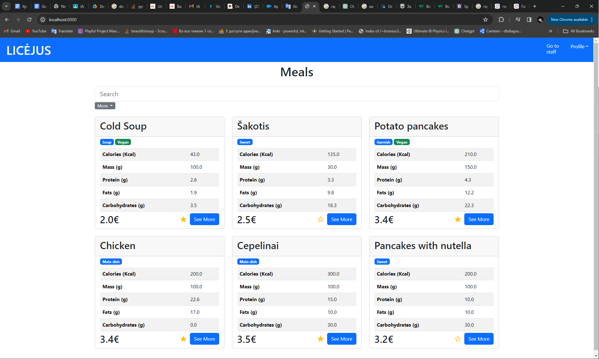
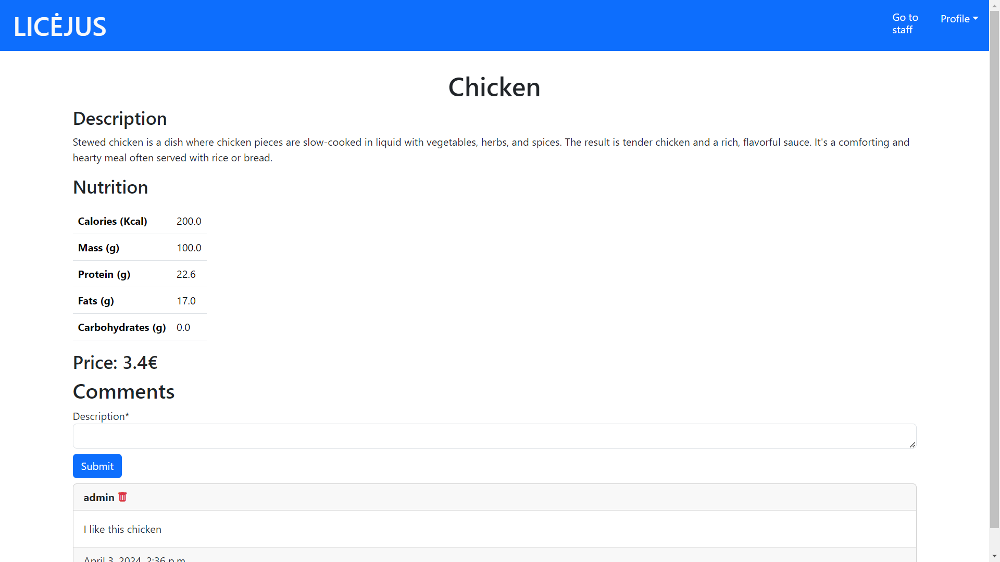
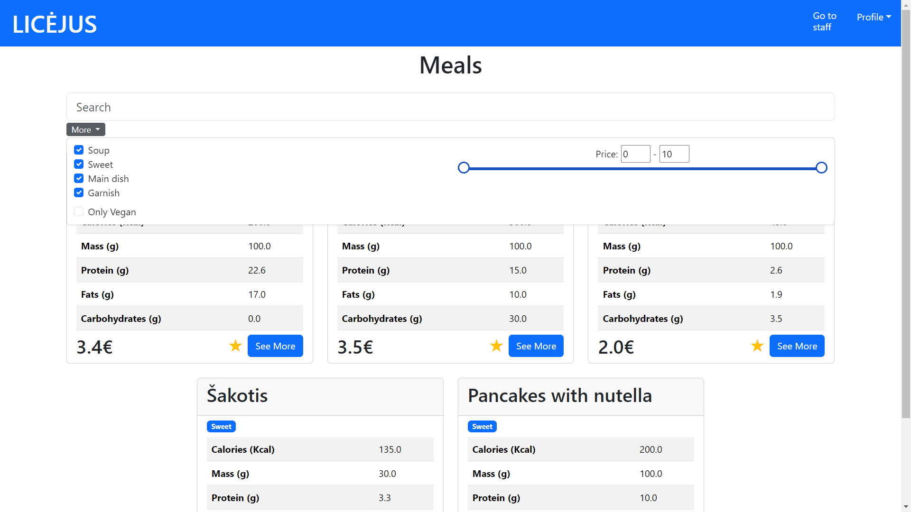

# Canteen Menu Program for Vilnius Lyceum

## Description
This program was created as part of my IB Computer Science Internal Assessment. It serves as a digital menu for Vilnius Lyceum, allowing students to browse through the meals available on today's menu. Students can mark their favorite meals and leave comments. The application aims to enhance the user experience by providing detailed nutritional information and prices for each meal, making it easier for students to make informed choices.

## Features
- Browse today's menu with detailed nutritional information
- Mark favorite meals for quick access
- Leave comments and feedback on meals
- Filter meals by type and dietary preferences

## Installation Instructions

### Download the Project:
Clone or download the project to your local machine.

### Create a Python Virtual Environment:
Open your command line interface and navigate to the project folder. Create a virtual environment using the following command:
```bash
python -m venv (Path To Project)
```

The recommended Python version is 3.11, as the program was developed using this version.

### Install Required Libraries:
Activate your virtual environment and install the required libraries by running:
```bash
pip install -r requirements.txt
```

### Run the Program:
Navigate to the canteen_menu folder:
```bash
cd canteen_menu
```

### Start the server using:
```bash
py manage.py runserver
```

Open your web browser and go to `localhost:8000`. You can log in using the admin credentials:

- **Username:** admin
- **Password:** admin

**Note:** These credentials are for demonstration purposes only and are not used in the real program. The real program is localized to the local language, while this documentation is in English.

## Usage

Once the server is running, you can navigate through the menu, mark your favorite meals, and leave comments. Here are some screenshots of the application in action:

## Screenshots

### Main Menu:


### Meal Details:


### Filter and Search:


## License

This project is licensed under the MIT License. See the [LICENSE](LICENSE) file for more details.
